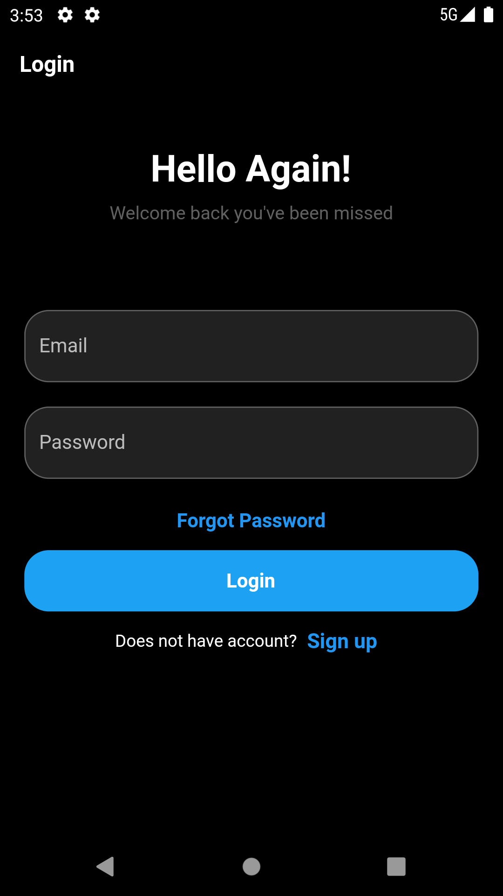

<!-- <h1 style="color: red; text-shadow: 2px 2px 2px #000000;font-family: Times New Roman;">Svik 2</h1> -->

# [Svik](https://svik.netlify.app)

Svik is a simple & personalized social app

🔴 **Under development**

### Tech. stack

* [Dart](https://dart.dev)
* [flutter](https://flutter.dev) Google UI toolkit for building beautiful and native applications
* [GetIt](https://pub.dev/packages/get_it) for dependency injection
* [Dio](https://pub.dev/packages/dio) for http requests
* [Shared Preferences](https://pub.dev/packages/shared_preferences) for storing data like tokens,search history etc...
* [BLoc](https://pub.dev/packages/flutter_bloc) for State Management

| Feature         | Status       |
|-----------------|--------------|
| Login/Signup    | Completed    |
| Basic Settings  | Completed    |
| Search Users    | Under Dev    |
| Messaging       | Under Dev    |
| Post sharing    | Under Dev    |

<!-- ## Dependencies

Here are the packages used in this Flutter project:

 -->

## Screenshots

## License
This project is licensed under the Apache License 2.0. You can read the full text of the license [here](https://www.apache.org/licenses/LICENSE-2.0).

